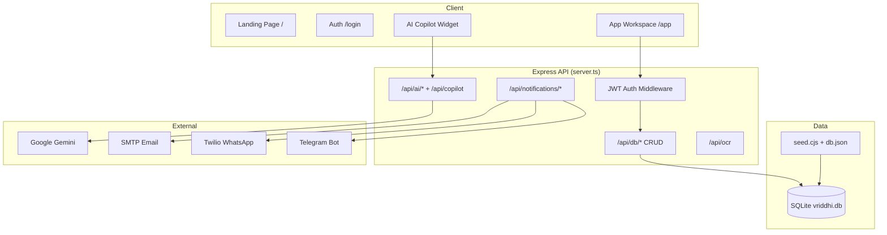

# Vriddhi.Ai

**Financial Tracking & GST Invoicing for Indian SMBs**

Vriddhi.Ai is a production-ready finance copilot built for **Track 3 — Vriddhi Capital Hackathon**. It helps startups and small businesses track profit & loss, manage receivables and payables, generate GST-compliant invoices, and automate client communications via Email and WhatsApp — with an AI assistant that drafts invoices, audits compliance, categorizes bank imports, and executes finance actions from natural language.

**Live demo:** https://vriddhi-ai.onrender.com  
**App login:** https://vriddhi-ai.onrender.com/login  
**Repository:** [github.com/Yogesh-101/Vriddhi-Ai](https://github.com/Yogesh-101/Vriddhi-Ai)

---

## Table of Contents

- [Overview](#overview)
- [Key Capabilities](#key-capabilities)
- [Architecture](#architecture)
- [Tech Stack](#tech-stack)
- [Project Structure](#project-structure)
- [Getting Started](#getting-started)
- [Environment Variables](#environment-variables)
- [Demo Credentials & URLs](#demo-credentials--urls)
- [User Roles (RBAC)](#user-roles-rbac)
- [Feature Checklist — Track 3](#feature-checklist--track-3)
- [AI Features](#ai-features)
- [Notifications Setup](#notifications-setup)
- [API Reference](#api-reference)
- [Deployment](#deployment)
- [Available Scripts](#available-scripts)
- [Troubleshooting](#troubleshooting)
- [Submission Compliance](#submission-compliance)

---

## Overview

Indian SMBs need more than spreadsheets: they need GST-compliant invoicing (CGST/SGST/IGST), receivables tracking, category-wise P&L, and automated payment reminders. Vriddhi.Ai delivers all of this in a single deployable product with:

- A **public marketing homepage** (no login required)
- A **authenticated workspace** with role-based access
- **SQLite persistence** — all CRUD survives refresh and restart
- **Preloaded realistic seed data** so every screen is populated on first load
- **Live notification integrations** (Email + WhatsApp) with admin audit logs
- **Gemini-powered AI** with rule-based fallbacks when quota is unavailable

---

## Key Capabilities

| Area | What you get |
|------|----------------|
| **Ledger** | Income & expense entries with category tags, CSV bank import, receipt attachments |
| **GST Invoicing** | Sequential invoice numbering, GSTIN, HSN/SAC, intra/inter-state tax split, PDF export, simulated IRN |
| **Collections** | Receivables & payables aging, overdue detection, L1→L3 escalation, recurring invoices |
| **Reporting** | Dashboard KPIs, P&L by date range, category charts, YoY/MoM comparisons, Tally-style CSV export |
| **Admin** | Central Settings panel — users, notification logs, contact leads, full data export vault |
| **AI Copilot** | Voice/text commands, NL invoice creation, GST audit score, smart categorization, action execution |

---

## Architecture



**Request flow:** React SPA → REST API (`/api/*`) → SQLite via `database.ts`. The frontend uses a Supabase-compatible client (`src/lib/supabase.ts`) that proxies to these endpoints with JWT bearer tokens.

---

## Tech Stack

| Layer | Technologies |
|-------|--------------|
| **Frontend** | React 19, TypeScript, Vite 6, React Router 7, Tailwind CSS 4, Recharts, Motion |
| **UI** | shadcn/ui-style components, Lucide icons, dark mode |
| **Backend** | Node.js, Express 4, JWT sessions, SHA-256 password hashing |
| **Database** | SQLite via `better-sqlite3` — file at `data/vriddhi.db` |
| **AI** | Google Gemini (`gemini-2.0-flash` default), `ai-services.ts` rule-based fallbacks |
| **Notifications** | Nodemailer (SMTP), Twilio WhatsApp API, Telegram Bot API |
| **DevOps** | Docker multi-stage build, Docker Compose, Render.com (`render.yaml`) |

---

## Project Structure

```
Vriddhi.Ai/
├── server.ts              # Express server, auth, API routes, Vite dev middleware
├── database.ts            # SQLite schema, migrations, CRUD helpers
├── notifications.ts       # Email, WhatsApp, Telegram dispatch
├── ai-services.ts         # Gemini + rule-based AI logic
├── seed.cjs               # Database seeder (reads db.json)
├── db.json                # Seed data source
├── docker-compose.yml     # Local production container
├── Dockerfile             # Multi-stage production image
├── render.yaml            # Render.com deployment blueprint
├── index.html             # SEO meta tags
└── src/
    ├── App.tsx            # Routes: /, /login, /app
    ├── pages/
    │   ├── LandingPage.tsx
    │   ├── AuthPage.tsx
    │   └── AppLayout.tsx  # Sidebar nav, notification bell, module router
    ├── components/
    │   ├── Dashboard.tsx
    │   ├── Transactions.tsx
    │   ├── Invoices.tsx
    │   ├── Receivables.tsx
    │   ├── Clients.tsx
    │   ├── CashFlow.tsx
    │   ├── DocumentsOCR.tsx
    │   ├── Settings.tsx   # Admin panel
    │   └── Copilot.tsx    # Floating AI assistant
    ├── context/           # Auth, Role, Theme providers
    └── lib/
        ├── supabase.ts    # API client (not cloud Supabase)
        ├── ai-api.ts      # Frontend AI helpers
        └── notifications.ts
```

---

## Getting Started

### Prerequisites

- **Node.js** 20+ (22 recommended)
- **npm** 9+
- **Docker** & Docker Compose (optional, recommended for demo parity)

### Option A — Docker (recommended)

1. Clone the repository:
   ```bash
   git clone https://github.com/Yogesh-101/Vriddhi-Ai.git
   cd Vriddhi-Ai
   ```

2. Create a `.env` file in the project root (see [Environment Variables](#environment-variables)).

3. Build and run:
   ```bash
   docker compose up -d --build
   ```

4. Open **http://localhost:3000**

5. Verify health:
   ```bash
   curl http://localhost:3000/api/status
   ```

### Option B — Local development

```bash
npm install
npm run dev        # Starts Express + Vite HMR on PORT (default 3000)
```

### Option C — Production build (manual)

```bash
npm run build
NODE_ENV=production node dist/server.cjs
```

---

## Environment Variables

Create `.env` in the project root. **Never commit this file.**

| Variable | Required | Description |
|----------|----------|-------------|
| `GEMINI_API_KEY` | Recommended | Google AI Studio API key ([get one here](https://aistudio.google.com/apikey)). Format: `AIzaSy...` |
| `GEMINI_MODEL` | No | Default: `gemini-2.0-flash` |
| `JWT_SECRET` | Yes | Secret for signing session tokens. Use a long random string in production. |
| `APP_URL` | Yes (prod) | Public URL of deployed app — **https://vriddhi-ai.onrender.com** |
| `DATABASE_PATH` | No | Default: `./data/vriddhi.db` |
| `PORT` | No | Default: `3000` |
| `SMTP_HOST` | For live email | e.g. `smtp.gmail.com` |
| `SMTP_PORT` | For live email | e.g. `587` |
| `SMTP_USER` | For live email | Gmail address or SendGrid user |
| `SMTP_PASS` | For live email | Gmail App Password or SendGrid API key |
| `SMTP_FROM` | No | Default: `Vriddhi.Ai <noreply@vriddhi.ai>` |
| `ADMIN_EMAIL` | No | Receives contact form notifications |
| `TWILIO_ACCOUNT_SID` | For WhatsApp | From [Twilio Console](https://console.twilio.com) |
| `TWILIO_AUTH_TOKEN` | For WhatsApp | Twilio auth token |
| `TWILIO_WHATSAPP_FROM` | For WhatsApp | Sandbox: `whatsapp:+14155238886` |
| `TWILIO_WHATSAPP_DEFAULT_TO` | For WhatsApp | Your phone joined to Twilio sandbox: `whatsapp:+91XXXXXXXXXX` |
| `TELEGRAM_BOT_TOKEN` | Optional | Telegram Bot API token |
| `TELEGRAM_CHAT_ID` | Optional | Target chat ID for notifications |

**Example `.env` skeleton:**

```env
GEMINI_API_KEY=AIzaSy...
GEMINI_MODEL=gemini-2.0-flash
JWT_SECRET=change_me_to_a_long_random_string
APP_URL=http://localhost:3000

SMTP_HOST=smtp.gmail.com
SMTP_PORT=587
SMTP_USER=you@gmail.com
SMTP_PASS=your_app_password
ADMIN_EMAIL=admin@yourcompany.com

TWILIO_ACCOUNT_SID=AC...
TWILIO_AUTH_TOKEN=...
TWILIO_WHATSAPP_FROM=whatsapp:+14155238886
TWILIO_WHATSAPP_DEFAULT_TO=whatsapp:+916305080611
```

> **Note:** If Gemini quota is exceeded or the key is invalid, all AI features automatically fall back to deterministic rule-based logic — the app remains fully demonstrable.

---

## Demo Credentials & URLs

### URLs

| Page | Path | Auth |
|------|------|------|
| **Live homepage** | [https://vriddhi-ai.onrender.com/](https://vriddhi-ai.onrender.com/) | None |
| Public homepage (local) | `/` | None |
| Login / Signup | [https://vriddhi-ai.onrender.com/login](https://vriddhi-ai.onrender.com/login) | None |
| App workspace | [https://vriddhi-ai.onrender.com/app](https://vriddhi-ai.onrender.com/app) | JWT required |
| Admin panel | `/app` → **Settings** tab | Founder role only |
| Health check | [https://vriddhi-ai.onrender.com/api/health](https://vriddhi-ai.onrender.com/api/health) | None |
| System status | [https://vriddhi-ai.onrender.com/api/status](https://vriddhi-ai.onrender.com/api/status) | None |

### Pre-seeded accounts

| Role | Email | Password | Access |
|------|-------|----------|--------|
| **Founder (Admin)** | `arjun@vriddhicapital.com` | `password123` | Full access + Settings admin panel |
| **Accountant** | `sanjana@vriddhicapital.com` | `password123` | Ledger, invoices, clients (no Settings) |
| **Viewer** | `neha@vriddhicapital.com` | `password123` | Read-only dashboards and invoices |

You can also **sign up** at `/login` and select a role during registration.

### Preloaded database content

On first run (or after re-seed), SQLite contains:

| Entity | Count (approx.) |
|--------|-----------------|
| Users | 3 |
| Clients & vendors | 9 |
| Transactions | 25 |
| GST invoices | 13 |
| Budget categories | 6 |
| Notification logs | 20+ |
| Contact requests | 1+ |

**Re-seed:** Dashboard → Re-seed button (Founder), or `POST /api/reseed` with a valid JWT.

---

## User Roles (RBAC)

| Module | Founder | Accountant | Viewer |
|--------|:-------:|:----------:|:------:|
| Dashboard | ✅ | ✅ | ✅ |
| Cash Flow Forecast | ✅ | ✅ | ✅ |
| Documents OCR | ✅ | — | — |
| GST Invoices | ✅ | ✅ | ✅ (read) |
| Transactions | ✅ | ✅ | — |
| Receivables/Payables | ✅ | ✅ | ✅ (read) |
| Clients | ✅ | ✅ | — |
| **Settings (Admin)** | ✅ | — | — |

Navigation is filtered automatically based on the logged-in role.

---

## Feature Checklist — Track 3

### Must-Have Features (15/15)

| # | Requirement | Implementation |
|---|-------------|----------------|
| 1 | Income/revenue entry + categories | `Transactions.tsx` — Product Sales, Services, Consulting, Other Income |
| 2 | Expenditure entry + categories | `Transactions.tsx` — Salaries, Rent, Marketing, Software, Utilities, Vendor Payments |
| 3 | Receivables tracker | `Receivables.tsx` — outstanding client invoices, due dates, status filters |
| 4 | Payables tracker | `Receivables.tsx` — Payables tab, pending vendor expenses |
| 5 | Auto P&L + date filter | `Dashboard.tsx` — P&L statement, Last 30 / 90 / Custom range |
| 6 | Category breakdown + charts | `Dashboard.tsx` — pie chart, expense breakdown bar chart |
| 7 | GST-compliant invoice generation | `Invoices.tsx` — `INV-YYYY-NNN`, GSTIN, HSN/SAC, CGST/SGST/IGST by place of supply |
| 8 | Invoice PDF download | `Invoices.tsx` — browser print / PDF via `handlePrintDownload()` |
| 9 | Invoice status tracking | Draft, Sent, Paid, Overdue, Partially Paid |
| 10 | Client/vendor master records | `Clients.tsx` — reusable across invoices and transactions |
| 11 | Automated invoice delivery | Email + WhatsApp on issue via `/api/notifications/send` |
| 12 | Automated payment reminders | Auto-overdue detection + manual trigger + L1→L3 escalation |
| 13 | Recurring invoices | Checkbox on create; auto-generates next invoice on schedule |
| 14 | Dashboard financial metrics | Revenue, expenses, net profit, receivables, cash position, period filter |
| 15 | Central admin panel + export | `Settings.tsx` — users, notification logs, contact leads, Tally/CSV export vault |

### Good-to-Have Features (10/10)

| # | Requirement | Implementation |
|---|-------------|----------------|
| 1 | Bank CSV import + auto-categorization | `Transactions.tsx` → Import Bank CSV + AI smart categorization |
| 2 | Multi-user RBAC | `RoleContext.tsx` — Founder / Accountant / Viewer |
| 3 | Tax estimate calculator | `CashFlow.tsx` — GST liability + advance tax estimator |
| 4 | Receipt image upload | `Transactions.tsx` — base64 attachment on expenses |
| 5 | Budget vs actual | `Dashboard.tsx` — editable budget cards per category |
| 6 | Multi-currency invoices | `Invoices.tsx` — INR, USD, EUR, GBP, SGD + exchange rate |
| 7 | Simulated e-invoicing IRN | `Invoices.tsx` — 64-char IRN + ACK number/date on PDF |
| 8 | Escalating reminder sequence | L1 (friendly) → L2 (urgent) → L3 (final notice), AI-composed text |
| 9 | YoY / MoM comparison charts | `Dashboard.tsx` — quarterly growth comparison |
| 10 | Accountant export formats | Tally ERP CSV + Excel bookkeeping CSV on Dashboard and Settings |

---

## AI Features

Vriddhi.Ai includes five production AI capabilities powered by **Google Gemini** with **rule-based fallbacks**:

| Feature | Endpoint / UI | Example |
|---------|---------------|---------|
| **Natural-language invoice draft** | `/api/ai/invoice-draft`, Invoice modal, Copilot | *"Create invoice for Alpha Corp — 40 hrs @ ₹5000, due in 15 days"* |
| **GST compliance checker** | `/api/ai/gst-audit`, Invoice modal | Live score 0–100, errors/warnings before issuing |
| **Action-capable Copilot** | `/api/copilot`, floating widget | *"Send reminders for overdue invoices above ₹1 lakh"* |
| **Smart CSV categorization** | `/api/ai/categorize-csv`, CSV importer | Confidence % + reason per bank row |
| **AI payment reminders** | `/api/ai/compose-reminder`, notification pipeline | Separate Email body + short WhatsApp message per escalation level |

Additional AI utilities:

- **Receipt OCR** — `/api/ocr` extracts vendor, date, GSTIN, amount from receipt images (`DocumentsOCR.tsx`)
- **Voice commands** — Web Speech API in Copilot (English / Indian English)

---

## Notifications Setup

### Email (SMTP)

1. For Gmail: enable 2FA → create an [App Password](https://myaccount.google.com/apppasswords)
2. Set `SMTP_HOST`, `SMTP_USER`, `SMTP_PASS` in `.env`
3. Test: `POST /api/notifications/test` with JWT

### WhatsApp (Twilio Sandbox — free)

1. Sign up at [twilio.com](https://www.twilio.com)
2. Go to **Messaging → Try WhatsApp** and join the sandbox from your phone
3. Set `TWILIO_ACCOUNT_SID`, `TWILIO_AUTH_TOKEN`, `TWILIO_WHATSAPP_FROM`, `TWILIO_WHATSAPP_DEFAULT_TO`
4. Test: `POST /api/notifications/test-whatsapp` with JWT

### Telegram (optional)

1. Create a bot via [@BotFather](https://t.me/BotFather)
2. Set `TELEGRAM_BOT_TOKEN` and `TELEGRAM_CHAT_ID`

### Admin audit trail

All dispatches (live and simulated) are logged to the `notification_logs` table and visible under **Settings → Notification Logs** with CSV export.

Check channel status anytime:

```bash
curl http://localhost:3000/api/status
# → notifications: { email: true, whatsapp: true, telegram: false }
```

---

## API Reference

### Public endpoints

| Method | Path | Description |
|--------|------|-------------|
| `GET` | `/api/health` | Health check for load balancers |
| `GET` | `/api/status` | Database, notification, and AI configuration status |
| `POST` | `/api/auth/login` | Login — returns JWT |
| `POST` | `/api/auth/signup` | Register new user with role |
| `POST` | `/api/contact` | Public contact / demo request form |
| `POST` | `/api/ocr` | Receipt image OCR |

### Authenticated endpoints (Bearer JWT)

| Method | Path | Description |
|--------|------|-------------|
| `GET` | `/api/db/:table` | Read table (`users`, `clients`, `transactions`, `invoices`, …) |
| `POST` | `/api/db/:table` | Insert record(s) |
| `PUT` | `/api/db/:table/:column/:value` | Update matching records |
| `DELETE` | `/api/db/:table/:column/:value` | Delete matching records |
| `POST` | `/api/reseed` | Reset database to seed data |
| `POST` | `/api/notifications/send` | Dispatch Email / WhatsApp / Telegram |
| `POST` | `/api/notifications/test` | Test SMTP configuration |
| `POST` | `/api/notifications/test-whatsapp` | Test Twilio WhatsApp |
| `POST` | `/api/copilot` | AI copilot query + optional actions |
| `POST` | `/api/ai/gst-audit` | GST compliance audit |
| `POST` | `/api/ai/invoice-draft` | Parse natural-language invoice request |
| `POST` | `/api/ai/categorize-csv` | AI-categorize bank statement rows |
| `POST` | `/api/ai/compose-reminder` | Generate personalized reminder text |

**Auth header:** `Authorization: Bearer <token>`

---

## Deployment

### Render.com (recommended)

The repo includes `render.yaml` for one-click blueprint deployment.

1. Push to GitHub
2. Create a new **Web Service** on [Render](https://render.com) → connect repo → **Docker** runtime
3. Set all environment variables from the table above
4. Set `APP_URL` to your Render service URL (live: **https://vriddhi-ai.onrender.com**)
5. Attach a **persistent disk** mounted at `/app/data` (1 GB minimum)
6. Set health check path to `/api/health`

> **Important:** If Render generates a new `JWT_SECRET`, demo password hashes won't match. Either set `JWT_SECRET=vriddhi_super_secret_jwt_key_2026` explicitly, or call `POST /api/reseed` after first deploy.

### Docker Compose (self-hosted)

```bash
docker compose up -d --build
docker compose logs -f
```

Data persists in the `vriddhi_data` Docker volume.

---

## Available Scripts

| Command | Description |
|---------|-------------|
| `npm run dev` | Development server (Express + Vite HMR) |
| `npm run build` | Production frontend build + server bundle |
| `npm start` | Run production server (`dist/server.cjs`) |
| `npm run lint` | TypeScript type check (`tsc --noEmit`) |
| `npm run clean` | Remove build artifacts |

---

## Troubleshooting

| Symptom | Cause | Fix |
|---------|-------|-----|
| Empty data pages after login | Stale JWT or wrong port | Log out, use **http://localhost:3000**, log in again |
| Notifications show SIMULATED | Missing or stale `.env` | Set SMTP/Twilio vars, restart: `docker compose up -d --build` |
| WhatsApp not delivered | Phone not in Twilio sandbox | Send join code to sandbox number from your phone |
| AI returns generic answers | Invalid Gemini key or quota exceeded | Use `AIzaSy...` key from AI Studio; app falls back to rules automatically |
| `401` on API calls | Expired token | Log out and log back in |
| Port 3000 vs 3001 conflict | Two servers running | Use Docker on **3000** only, or stop the other instance |
| Demo logins fail after deploy | JWT_SECRET changed | Set explicit `JWT_SECRET` or re-seed database |

---

## Submission Compliance

| General Rule | Status |
|--------------|--------|
| Production-ready deployable product | ✅ Docker + production build |
| Live public URL | ✅ [https://vriddhi-ai.onrender.com](https://vriddhi-ai.onrender.com) |
| Real SQLite database with persistence | ✅ |
| Preloaded sample data on every entity | ✅ Auto-seed |
| Forms submit and persist | ✅ Contact, signup, all CRUD |
| Email + WhatsApp notifications | ✅ Live when configured |
| Central admin panel | ✅ Settings (Founder) |
| Auth for all roles | ✅ Signup, login, logout, JWT sessions |
| Responsive UI | ✅ Mobile sidebar + responsive tables |
| SEO-friendly | ✅ Meta tags in `index.html` |
| No placeholder / Lorem ipsum content | ✅ |

---

## License

Built for the **Vriddhi Capital Hackathon — Track 3**.  
© 2026 Vriddhi.Ai. All rights reserved.
